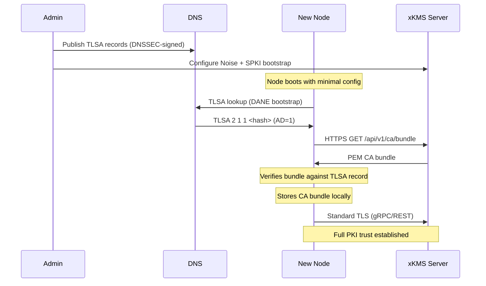

# Bootstrap Integration Guide

This guide covers how each project in the go-xkms ecosystem uses the bootstrap subsystem to establish trust with a xkms server.

All projects import from the SDK bootstrap package:

```go
import bootstrap "github.com/jeremyhahn/go-xkms/sdk/go/bootstrap"
```

## Quick Reference

| Project | Mode | Primary Method | Use Case |
|---------|------|----------------|----------|
| go-xkms | Server | N/A (serves bundles) | Publishes CA bundles and TLSA records |
| xkey | Remote client | Auto (DANE -> Direct) | Connects to remote xkmsd over TLS |
| go-trusted-ca | Embedded / Remote | Embedded or Auto | In-process CA or remote xkms server |
| go-trusted-platform | Remote client | Auto (full chain) | Zero-touch node enrollment |

## go-xkms (Server Side)

go-xkms is the **server** that other projects bootstrap against. It serves CA bundles on the REST endpoint `GET /api/v1/ca/bundle` and optionally on the Noise protocol listener (port 8445).

### Server Configuration

```yaml
# xkmsd.yaml
bootstrap:
  noise:
    enabled: true
    static_key_file: /etc/xkms/noise-static.key
    max_connections: 100
    read_timeout: 30s
    write_timeout: 30s
  spki:
    enabled: true
    pin_sha256: "a1b2c3d4..."
  dane:
    enabled: true
    hostname: kms.example.com
    port: 8443
    dns_server: ""  # System resolver
```

### DANE Setup

Generate TLSA records for DNS publishing:

```bash
# Generate the recommended 2 1 1 record
xkmsctl bootstrap dane generate-tlsa \
  --cert-file /etc/xkms/ca.pem \
  --hostname kms.example.com \
  --port 8443

# Generate all common DANE-TA variants for redundancy
xkmsctl bootstrap dane generate-tlsa \
  --cert-file /etc/xkms/ca.pem \
  --hostname kms.example.com \
  --port 8443 --all
```

Publish the output TLSA records in your DNSSEC-signed zone:

```dns
_8443._tcp.kms.example.com. IN TLSA 2 1 1 a1b2c3d4e5f6...
```

### Noise Key Setup

```bash
# Generate the server's Noise static keypair
xkmsctl bootstrap noise generate-key --output /etc/xkms/noise-static.key

# Show the public key to distribute to clients
xkmsctl bootstrap noise show-key --key-file /etc/xkms/noise-static.key
```

### Verify TLSA Records

```bash
# Check that TLSA records resolve correctly
xkmsctl bootstrap dane show-tlsa \
  --hostname kms.example.com \
  --port 8443

# Verify records match the server's CA certificate
xkmsctl bootstrap dane verify-tlsa \
  --hostname kms.example.com \
  --port 8443 \
  --cert-file /etc/xkms/ca.pem
```

## xkey

xkey currently connects to xkmsd via Unix sockets for the phone bridge feature. When xkey needs to connect to a **remote xkmsd** over TLS (distributed deployment), bootstrap provides the initial CA trust.

### Integration Pattern

```go
package main

import (
    "context"
    "crypto/tls"
    "crypto/x509"
    "log"

    "github.com/jeremyhahn/go-xkms/sdk/go/bootstrap"
    "github.com/jeremyhahn/go-xkms/sdk/go/transport"
    grpctransport "github.com/jeremyhahn/go-xkms/sdk/go/transport/grpc"
)

func bootstrapAndConnect(ctx context.Context, serverURL string) (transport.Client, error) {
    // Bootstrap the CA bundle using auto-discovery.
    // DANE is tried first (zero config), then Direct as fallback.
    resp, err := bootstrap.AutoFetch(ctx, &bootstrap.AutoConfig{
        DANE: &bootstrap.DANEConfig{
            ServerURL: serverURL,
        },
        Direct: &bootstrap.DirectConfig{
            ServerURL: serverURL,
        },
    })
    if err != nil {
        return nil, err
    }

    // Build a certificate pool from the bootstrapped CA bundle.
    pool := x509.NewCertPool()
    for _, der := range resp.Certificates {
        cert, err := x509.ParseCertificate(der)
        if err != nil {
            continue
        }
        pool.AddCert(cert)
    }

    // Create a xkmsd client with proper TLS.
    client, err := grpctransport.New(
        transport.WithAddress("kms.example.com:9090"),
        transport.WithTLSConfig(&tls.Config{RootCAs: pool}),
    )
    if err != nil {
        return nil, err
    }

    return client, nil
}
```

### Configuration

xkey's `xkmsd` config section would add bootstrap settings:

```yaml
# ~/.xkey/config.yaml
xkmsd:
  enabled: true
  protocol: grpc
  address: kms.example.com:9090
  tls:
    enabled: true
  bootstrap:
    server_url: "https://kms.example.com:8443"
    dane:
      enabled: true
    direct:
      enabled: true
```

When `tls.enabled` is true and no local CA bundle exists, xkey runs the bootstrap sequence before establishing the transport connection.

## go-trusted-ca

go-trusted-ca runs go-xkms as a library and may also connect to external xkms servers. It has two integration modes.

### Embedded Mode (In-Process)

When go-trusted-ca runs go-xkms as an embedded library, the CA bundle is retrieved in-process without any network communication:

```go
package main

import (
    "context"
    "log"

    "github.com/jeremyhahn/go-xkms/sdk/go/bootstrap"
)

func main() {
    // myCABundler implements grpc.CABundler — typically the
    // xkms service instance running in the same process.
    bootstrapper, err := bootstrap.NewEmbeddedBootstrapper(myCABundler)
    if err != nil {
        log.Fatal(err)
    }
    defer bootstrapper.Close()

    // Fetch root ECDSA certificates — no network call.
    resp, err := bootstrapper.FetchCABundle(context.Background(), &bootstrap.CABundleRequest{
        StoreType: "root",
        Algorithm: "ECDSA",
    })
    if err != nil {
        log.Fatal(err)
    }

    log.Printf("Retrieved %d certificates in-process", len(resp.Certificates))
    // Use resp.BundlePEM or resp.Certificates directly for TLS configuration.
}
```

The `EmbeddedBootstrapper` calls the `CABundler.CABundle()` method directly, producing the same PEM output as the REST endpoint but without serialization overhead.

### Remote Mode (External xKMS Server)

When go-trusted-ca connects to a separate xkms server, use `AutoFetch` with all available methods:

```go
package main

import (
    "context"
    "log"
    "os"

    "github.com/jeremyhahn/go-xkms/sdk/go/bootstrap"
)

func main() {
    resp, err := bootstrap.AutoFetch(context.Background(), &bootstrap.AutoConfig{
        // DANE: zero pre-shared secrets, highest priority.
        DANE: &bootstrap.DANEConfig{
            ServerURL: "https://kms.example.com:8443",
        },
        // Noise: fallback if DNSSEC is unavailable.
        Noise: &bootstrap.NoiseConfig{
            ServerAddr:      "kms.example.com:8445",
            ServerStaticKey: cfg.Bootstrap.Noise.ServerStaticKey,
        },
        // SPKI: fallback if Noise port is blocked.
        SPKI: &bootstrap.PinnedTLSConfig{
            ServerURL:     "https://kms.example.com:8443",
            SPKIPinSHA256: cfg.Bootstrap.SPKI.PinSHA256,
        },
        // Direct: last resort when system already trusts the CA.
        Direct: &bootstrap.DirectConfig{
            ServerURL: "https://kms.example.com:8443",
        },
    })
    if err != nil {
        log.Fatal(err)
    }

    // Persist the CA bundle for subsequent TLS connections.
    if err := os.WriteFile("/etc/trusted-ca/ca-bundle.pem", resp.BundlePEM, 0644); err != nil {
        log.Fatal(err)
    }

    log.Printf("CA bundle written (%d certificates)", len(resp.Certificates))
}
```

### Choosing Between Modes

| Scenario | Mode | Bootstrap Method |
|----------|------|-----------------|
| Single-binary CA deployment | Embedded | `NewEmbeddedBootstrapper` |
| CA service + separate xkms server | Remote | `AutoFetch` |
| Hybrid (embedded xkms + remote CA peers) | Both | Embedded locally, Auto for peers |

## go-trusted-platform

go-trusted-platform bootstraps new nodes into a trusted computing platform. The bootstrap subsystem provides the initial CA trust anchor before the node can participate in the PKI.

### Node Bootstrap with AutoFetch

```go
package main

import (
    "context"
    "crypto/tls"
    "crypto/x509"
    "errors"
    "log"
    "os"

    xkms "github.com/jeremyhahn/go-xkms/sdk/go"
    "github.com/jeremyhahn/go-xkms/sdk/go/bootstrap"
)

func main() {
    ctx := context.Background()

    // Try all methods in priority order.
    // DANE requires no pre-shared secrets — ideal for automated provisioning.
    // DNSSEC validation is always enforced by the DANE bootstrapper.
    resp, err := bootstrap.AutoFetch(ctx, &bootstrap.AutoConfig{
        DANE: &bootstrap.DANEConfig{
            ServerURL: "https://kms.example.com:8443",
            // Hostname and Port extracted from URL.
        },
        Noise: &bootstrap.NoiseConfig{
            ServerAddr:      "kms.example.com:8445",
            ServerStaticKey: cfg.Bootstrap.Noise.ServerStaticKey,
        },
        SPKI: &bootstrap.PinnedTLSConfig{
            ServerURL:     "https://kms.example.com:8443",
            SPKIPinSHA256: cfg.Bootstrap.SPKI.PinSHA256,
        },
        Direct: &bootstrap.DirectConfig{
            ServerURL: "https://kms.example.com:8443",
        },
    })
    if err != nil {
        // Log individual method failures for diagnostics.
        var agg *bootstrap.AggregateError
        if errors.As(err, &agg) {
            for _, attempt := range agg.Attempts {
                log.Printf("bootstrap method %s: %v", attempt.Method, attempt.Err)
            }
        }
        log.Fatal(err)
    }

    // Persist the CA bundle.
    if err := os.WriteFile("/etc/xkms/ca-bundle.pem", resp.BundlePEM, 0644); err != nil {
        log.Fatal(err)
    }

    // Build TLS config from bootstrapped certificates.
    pool := x509.NewCertPool()
    for _, der := range resp.Certificates {
        cert, err := x509.ParseCertificate(der)
        if err != nil {
            continue
        }
        pool.AddCert(cert)
    }

    // Create a normal SDK client with full TLS trust.
    client, err := xkms.New(
        xkms.WithTransport("grpc"),
        xkms.WithAddress("kms.example.com:9090"),
        xkms.WithTLSConfig(&tls.Config{RootCAs: pool}),
    )
    if err != nil {
        log.Fatal(err)
    }
    defer client.Close()

    log.Printf("Node bootstrapped with %d CA certificates, connected to xkms server",
        len(resp.Certificates))
}
```

### Provisioning Workflow



### Deployment Configurations

**Cloud deployment (DANE only):**

```yaml
bootstrap:
  server_url: "https://kms.example.com:8443"
  dane:
    enabled: true
    # No pre-shared secrets needed. DNSSEC handles trust.
```

**Air-gapped environment (Noise only):**

```yaml
bootstrap:
  noise:
    enabled: true
    server_addr: "kms.internal:8445"
    server_static_key: "a1b2c3d4..."  # Distributed via secure provisioning
```

**Resilient deployment (all methods):**

```yaml
bootstrap:
  server_url: "https://kms.example.com:8443"
  method_order: [dane, noise, spki, direct]
  per_method_timeout: 15s
  dane:
    enabled: true
  noise:
    enabled: true
    server_addr: "kms.example.com:8445"
    server_static_key: "a1b2c3d4..."
  spki:
    enabled: true
    pin_sha256: "e5f6a7b8..."
  direct:
    enabled: true
```

## Method Priority Reference

| Priority | Method | Pre-Shared Secret | DNSSEC Required | Proxy-Safe | Best For |
|----------|--------|-------------------|-----------------|------------|----------|
| 1 | DANE/TLSA | None | Yes | Yes | Production with DNSSEC-signed zones |
| 2 | Noise_NK | 32-byte Curve25519 key | No | No | Environments without DNSSEC |
| 3 | SPKI Pin | SHA-256 hash | No | Yes | Deployments behind HTTP proxies |
| 4 | Direct HTTPS | None (system CA) | No | Yes | Public CA or post-bootstrap |
| -- | Embedded | None (in-process) | No | N/A | Library consumers (go-trusted-ca) |

## Related Documentation

- [Bootstrap Protocol Reference](./bootstrap.md) -- Protocol details, security properties, and SDK API
- [DANE/TLSA Documentation](./dane.md) -- RFC 6698 details and DNSSEC trust chain
- [Bootstrap CLI Commands](../usage/cli/bootstrap.md) -- CLI reference
- [Bootstrap Configuration](../configuration/bootstrap.md) -- YAML configuration reference
