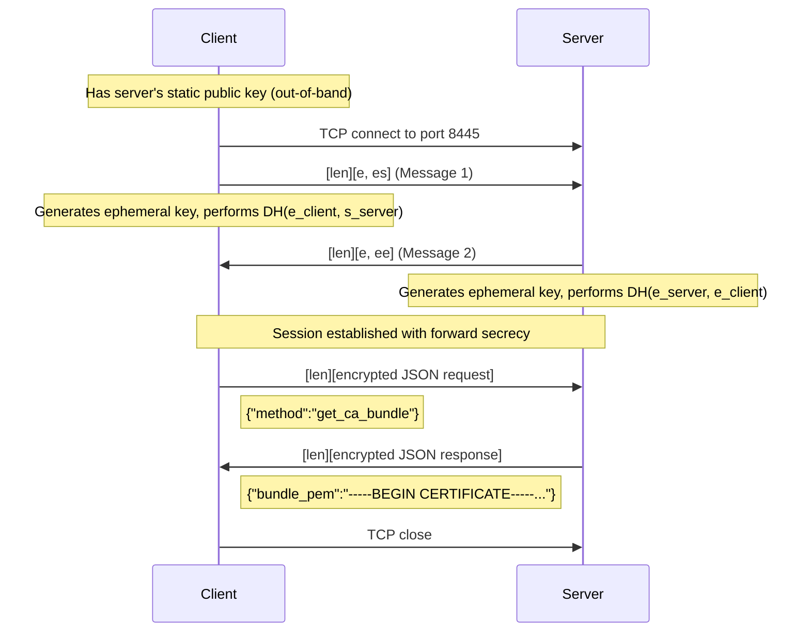
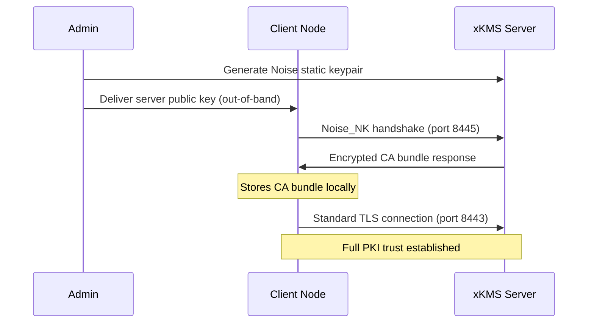

# Secure CA Bundle Bootstrap

## Problem Statement

Deploying a new node into a go-xkms cluster creates a chicken-and-egg problem: the node needs CA certificates to verify TLS connections, but the CA certificates live on the xkms server behind TLS. Without some form of trust anchor, the node cannot safely retrieve the certificates it needs to participate in the PKI.

Conventional approaches such as fetching the bundle over plain HTTP are vulnerable to man-in-the-middle attacks. Distributing the CA bundle by hand works but does not scale. go-xkms solves this with multiple bootstrap mechanisms that provide cryptographic assurance without requiring a pre-installed CA certificate.

## Overview

go-xkms provides four bootstrap mechanisms plus an in-process shortcut, tried in priority order by the AutoBootstrapper:

| Priority | Mechanism | Transport | Trust Anchor | Primary Use Case |
|----------|-----------|-----------|--------------|------------------|
| 1 | **DANE/TLSA** | HTTPS | DNSSEC-signed TLSA record | Production: zero pre-shared secrets |
| 2 | **Noise_NK** | Raw TCP (port 8445) | Server's Curve25519 public key | Production: structurally enforces server identity |
| 3 | **SPKI-pinned TLS** | HTTPS | SHA-256 hash of server's SPKI | Fallback: works through HTTP proxies |
| 4 | **Direct HTTPS** | HTTPS | System trust store | Last resort: no additional verification |
| -- | **Embedded** | In-process | Direct function call | Library consumers running go-xkms in-process |

DANE/TLSA is the highest-priority mechanism because it requires no pre-shared secrets -- the trust anchor is published in DNSSEC-signed DNS. Noise_NK is preferred when DNSSEC is not available, as it provides the strongest structural guarantees through cryptographic binding of the server's identity. For a detailed description of DANE, see the [DANE/TLSA documentation](./dane.md).

### AutoBootstrapper

The `AutoBootstrapper` tries each configured method in priority order and returns the first successful result. Methods whose configuration is nil are skipped. If all methods fail, an `AggregateError` is returned listing each individual failure.

Default method order: **DANE -> Noise -> SPKI -> Direct**

## Noise_NK Protocol

### Handshake Pattern

The Noise NK ("Known") pattern assumes the initiator (client) already knows the responder's (server's) static public key. This eliminates the need for a certificate chain or trust store during the initial connection.

The NK pattern is a 2-message handshake (compared to 3 messages for XX mutual authentication):

```
Noise_NK(s):
  <- s                    # Pre-message: client knows server's static key
  -> e, es                # Message 1: client sends ephemeral, performs DH with server's static
  <- e, ee                # Message 2: server sends ephemeral, performs DH with client's ephemeral
```

Where:
- `s` = server's static Curve25519 public key (32 bytes, pre-shared)
- `e` = ephemeral Curve25519 key (generated per-handshake)
- `es` = DH between client's ephemeral and server's static
- `ee` = DH between client's ephemeral and server's ephemeral

### Cipher Suite

The implementation uses a fixed cipher suite:

- **DH:** Curve25519
- **Cipher:** ChaChaPoly (ChaCha20-Poly1305)
- **Hash:** SHA-256

### Wire Format

All messages are framed using a 2-byte big-endian length prefix over TCP:

```
+--------+--------+------------------+
| len_hi | len_lo |     payload      |
+--------+--------+------------------+
   1 byte   1 byte   0..65535 bytes
```

Maximum frame size is 65,535 bytes, matching the Noise protocol maximum message size.

### Sequence Diagram



### Default Port

The Noise bootstrap server listens on TCP port **8445** by default. This is separate from the main REST (8443), gRPC (9090), QUIC, and MCP ports to provide clear network segmentation for the bootstrap channel.

### Security Properties

- **Server authentication:** The server's identity is cryptographically verified in every handshake because the client's first DH operation (`es`) uses the server's known static key. An attacker without the corresponding private key cannot complete the handshake.
- **Forward secrecy:** Both sides generate fresh ephemeral keys per connection. Compromise of the server's static key after the session does not reveal past session content.
- **Confidentiality:** Post-handshake traffic is encrypted with ChaCha20-Poly1305 using session-specific keys derived from both DH operations.
- **Integrity:** Every encrypted frame includes a Poly1305 authentication tag. Tampered frames are rejected.

## SPKI-Pinned TLS

SPKI pinning provides a fallback bootstrap mechanism that works over standard HTTPS. Instead of verifying the server's certificate against a CA trust store (which the client does not yet have), the client verifies the server's SubjectPublicKeyInfo against a pre-shared SHA-256 hash.

### How It Works

1. The client obtains the server's SPKI SHA-256 pin out-of-band (64-character hex string).
2. The client connects over TLS with `InsecureSkipVerify: true` but installs a `VerifyPeerCertificate` callback.
3. The callback computes `SHA-256(server_cert.RawSubjectPublicKeyInfo)` and compares it to the expected pin.
4. If the pin matches, the connection proceeds. If not, the connection is rejected.

```go
// SPKI verification (simplified)
hash := sha256.Sum256(cert.RawSubjectPublicKeyInfo)
if hex.EncodeToString(hash[:]) != expectedPin {
    return ErrSPKIPinMismatch
}
```

### Pin Computation

The SPKI pin is a SHA-256 hash of the DER-encoded SubjectPublicKeyInfo structure from the server's X.509 certificate. This is the same approach used by HTTP Public Key Pinning (RFC 7469), though go-xkms uses hex encoding rather than base64.

To compute the pin, use the CLI:

```bash
# From a PEM certificate file
xkmsctl bootstrap noise show-spki-pin --cert-file /path/to/server.pem

# From a running server (connects with TLS, prints pin)
xkmsctl bootstrap noise show-spki-pin --server kms.example.com:8443
```

### When to Use SPKI Pinning

Use SPKI pinning when:
- The client sits behind an HTTP proxy that does not pass raw TCP
- Firewall rules restrict non-HTTPS traffic
- The deployment cannot open a separate port for the Noise protocol

Use Noise_NK when possible. SPKI-pinned TLS provides server authentication but relies on the TLS stack for the handshake, whereas Noise_NK provides structural guarantees at the protocol level.

## Direct HTTPS

Direct HTTPS is the simplest and least secure bootstrap mechanism. It fetches the CA bundle over standard HTTPS using the system's existing trust store. This works when the xkms server uses a certificate issued by a publicly trusted CA or when the system already has the server's CA installed.

### When to Use Direct HTTPS

- The xkms server uses a publicly trusted CA (e.g., Let's Encrypt)
- A previous bootstrap run has already installed the CA
- Development and testing environments

Direct HTTPS provides no additional verification beyond standard TLS. For production deployments with private CAs, use DANE, Noise, or SPKI instead.

### Configuration

```go
bootstrapper, err := bootstrap.NewDirectBootstrapper(&bootstrap.DirectConfig{
    ServerURL:  "https://kms.example.com:8443",
    BundlePath: "/api/v1/ca/bundle", // Default path
})
```

## Trust Anchor Distribution

Bootstrap mechanisms other than DANE require the client to obtain a small trust anchor before connecting:

| Mechanism | Trust Anchor | Size | Format |
|-----------|-------------|------|--------|
| DANE/TLSA | DNSSEC-signed TLSA record | Published in DNS | DNS record |
| Noise_NK | Server's Curve25519 public key | 32 bytes | 64-char hex string |
| SPKI pinning | SHA-256 of server's SPKI | 32 bytes | 64-char hex string |
| Direct | System CA trust store | N/A | Pre-installed |

DANE is preferred because the trust anchor (TLSA record) is published in DNSSEC-signed DNS and requires no out-of-band distribution. See the [DANE/TLSA documentation](./dane.md) for details.

### Distribution Methods

**Provisioning configuration file:** Include the trust anchor in the node's initial configuration file, distributed via secure provisioning (Ansible, cloud-init, sealed image, etc.).

```yaml
bootstrap:
  noise:
    enabled: true
    server_addr: "kms.example.com:8445"
    server_static_key: "a1b2c3d4e5f6..."
```

**Out-of-band delivery:** Transmit the 64-character hex string over a trusted channel such as an SSH session, encrypted email, or a secrets manager.

**QR code for mobile enrollment:** Encode the server's public key or SPKI pin in a QR code for scanning by mobile devices during enrollment.

**DNS TXT record (with DNSSEC):** Publish the trust anchor as a DNS TXT record under a zone signed with DNSSEC.

## Bootstrap Workflow

### Step-by-Step (Noise_NK)

1. **Generate server key:** On the xkms server, generate a Curve25519 static keypair using `xkmsctl bootstrap noise generate-key`. Store the private key securely. Record the public key.

2. **Distribute public key:** Deliver the 64-character hex public key string to the new node through a trusted channel.

3. **Configure the client:** Add the server address and public key to the node's bootstrap configuration.

4. **Connect via Noise_NK:** The SDK's `NoiseBootstrapper` opens a TCP connection to port 8445, performs the 2-message NK handshake, and requests the CA bundle over the encrypted channel.

5. **Store the CA bundle:** The client writes the returned PEM bundle to local storage (e.g., `/etc/xkms/ca-bundle.pem`).

6. **Switch to standard TLS:** With the CA bundle installed, the client reconfigures its TLS settings to use the CA certificate for standard X.509 verification. All subsequent connections use normal TLS with the full trust chain.



## SDK Usage

### DANE Bootstrap (Zero Pre-Shared Secrets)

```go
package main

import (
    "context"
    "log"
    "os"

    "github.com/jeremyhahn/go-xkms/sdk/go/bootstrap"
)

func main() {
    // Create a DANE bootstrapper. The trust anchor is resolved from DNS.
    // No pre-shared keys or pins are needed.
    // DNSSEC validation is always enforced.
    bootstrapper, err := bootstrap.NewDANEBootstrapper(&bootstrap.DANEConfig{
        ServerURL: "https://kms.example.com:8443",
        // Hostname and Port are extracted from ServerURL.
        // DNSServer defaults to system resolver.
    })
    if err != nil {
        log.Fatal(err)
    }
    defer bootstrapper.Close()

    resp, err := bootstrapper.FetchCABundle(context.Background(), &bootstrap.CABundleRequest{})
    if err != nil {
        log.Fatal(err)
    }

    if err := os.WriteFile("/etc/xkms/ca-bundle.pem", resp.BundlePEM, 0644); err != nil {
        log.Fatal(err)
    }

    log.Printf("CA bundle written (%d certificates, DANE-verified)", len(resp.Certificates))
}
```

### Auto Bootstrap (Tries All Methods)

```go
package main

import (
    "context"
    "log"
    "os"

    "github.com/jeremyhahn/go-xkms/sdk/go/bootstrap"
)

func main() {
    // AutoFetch tries DANE -> Noise -> SPKI -> Direct in order.
    // Configure only the methods available in your environment.
    resp, err := bootstrap.AutoFetch(context.Background(), &bootstrap.AutoConfig{
        DANE: &bootstrap.DANEConfig{
            ServerURL: "https://kms.example.com:8443",
        },
        Noise: &bootstrap.NoiseConfig{
            ServerAddr:      "kms.example.com:8445",
            ServerStaticKey: "a1b2c3d4e5f6a7b8c9d0e1f2a3b4c5d6e7f8a9b0c1d2e3f4a5b6c7d8e9f0a1b2",
        },
        // SPKI and Direct are nil, so they are skipped.
    })
    if err != nil {
        log.Fatal(err)
    }

    if err := os.WriteFile("/etc/xkms/ca-bundle.pem", resp.BundlePEM, 0644); err != nil {
        log.Fatal(err)
    }

    log.Printf("CA bundle written (%d certificates)", len(resp.Certificates))
}
```

### Noise Bootstrap (Remote Node)

```go
package main

import (
    "context"
    "log"
    "os"

    "github.com/jeremyhahn/go-xkms/sdk/go/bootstrap"
)

func main() {
    // Create a Noise_NK bootstrapper with the server's pre-shared public key.
    bootstrapper, err := bootstrap.NewNoiseBootstrapper(&bootstrap.NoiseConfig{
        ServerAddr:      "kms.example.com:8445",
        ServerStaticKey: "a1b2c3d4e5f6a7b8c9d0e1f2a3b4c5d6e7f8a9b0c1d2e3f4a5b6c7d8e9f0a1b2",
    })
    if err != nil {
        log.Fatal(err)
    }
    defer bootstrapper.Close()

    // Fetch the full CA bundle (root + intermediates).
    resp, err := bootstrapper.FetchCABundle(context.Background(), &bootstrap.CABundleRequest{})
    if err != nil {
        log.Fatal(err)
    }

    // Write the PEM bundle to disk.
    if err := os.WriteFile("/etc/xkms/ca-bundle.pem", resp.BundlePEM, 0644); err != nil {
        log.Fatal(err)
    }

    log.Printf("CA bundle written (%d certificates, %d bytes)",
        len(resp.Certificates), len(resp.BundlePEM))
}
```

### SPKI-Pinned TLS Bootstrap (Fallback)

```go
package main

import (
    "context"
    "log"
    "os"

    "github.com/jeremyhahn/go-xkms/sdk/go/bootstrap"
)

func main() {
    // Create a pinned-TLS bootstrapper with the server's SPKI pin.
    bootstrapper, err := bootstrap.NewPinnedTLSBootstrapper(&bootstrap.PinnedTLSConfig{
        ServerURL:     "https://kms.example.com:8443",
        SPKIPinSHA256: "e5f6a7b8c9d0e1f2a3b4c5d6e7f8a9b0c1d2e3f4a5b6c7d8e9f0a1b2c3d4e5f6",
    })
    if err != nil {
        log.Fatal(err)
    }
    defer bootstrapper.Close()

    // Fetch only root CA certificates using ECDSA keys.
    resp, err := bootstrapper.FetchCABundle(context.Background(), &bootstrap.CABundleRequest{
        StoreType: "root",
        Algorithm: "ECDSA",
    })
    if err != nil {
        log.Fatal(err)
    }

    if err := os.WriteFile("/etc/xkms/ca-bundle.pem", resp.BundlePEM, 0644); err != nil {
        log.Fatal(err)
    }

    log.Printf("CA bundle written (%d certificates)", len(resp.Certificates))
}
```

### Embedded Bootstrap (In-Process)

```go
package main

import (
    "context"
    "log"

    "github.com/jeremyhahn/go-xkms/sdk/go/bootstrap"
)

func main() {
    // When go-xkms runs in the same process, use the embedded
    // bootstrapper to skip network communication entirely.
    bootstrapper, err := bootstrap.NewEmbeddedBootstrapper(myCABundler)
    if err != nil {
        log.Fatal(err)
    }

    resp, err := bootstrapper.FetchCABundle(context.Background(), &bootstrap.CABundleRequest{})
    if err != nil {
        log.Fatal(err)
    }

    // Use resp.BundlePEM or resp.Certificates directly.
    log.Printf("Retrieved %d certificates in-process", len(resp.Certificates))
}
```

### Filtering Certificates

The `CABundleRequest` supports optional filters:

```go
// Fetch only root certificates
resp, _ := bootstrapper.FetchCABundle(ctx, &bootstrap.CABundleRequest{
    StoreType: "root",
})

// Fetch only intermediate certificates using ECDSA
resp, _ := bootstrapper.FetchCABundle(ctx, &bootstrap.CABundleRequest{
    StoreType: "intermediate",
    Algorithm: "ECDSA",
})

// Fetch all certificates (nil or empty request)
resp, _ := bootstrapper.FetchCABundle(ctx, nil)
```

**StoreType values:** `"root"`, `"intermediate"`, `"leaf"`, `"end-entity"`, `""` (all)

**Algorithm values:** `"RSA"`, `"ECDSA"`, `"Ed25519"`, `""` (all)

## API Reference

### Bootstrapper Interface

```go
type Bootstrapper interface {
    FetchCABundle(ctx context.Context, req *CABundleRequest) (*CABundleResponse, error)
    Close() error
}
```

### CABundleRequest

```go
type CABundleRequest struct {
    StoreType string  // "root", "intermediate", "leaf", "end-entity", or ""
    Algorithm string  // "RSA", "ECDSA", "Ed25519", or ""
}
```

### CABundleResponse

```go
type CABundleResponse struct {
    BundlePEM    []byte    // PEM-encoded certificate chain
    Certificates [][]byte  // Individual DER-encoded certificates
    ContentType  string    // "application/pem-certificate-chain"
}
```

## Security Considerations

### Forward Secrecy

Both Noise_NK and SPKI-pinned TLS provide forward secrecy. Noise_NK achieves this through ephemeral Curve25519 keys generated per connection. SPKI-pinned TLS inherits forward secrecy from TLS 1.2/1.3 cipher suites that use ephemeral Diffie-Hellman.

### Replay Protection

Noise sessions include implicit nonce counters in the CipherState. Replaying a captured ciphertext against a different session produces a decryption failure because the nonce and session keys differ.

For SPKI-pinned TLS, replay protection is provided by the TLS protocol's own mechanisms (random nonces in the handshake, sequence numbers in the record layer).

### Key Rotation

Rotate the server's Noise static key periodically:

1. Generate a new keypair with `xkmsctl bootstrap noise generate-key`.
2. Update the server configuration with the new private key.
3. Distribute the new public key to nodes that have not yet bootstrapped.
4. Restart the Noise bootstrap listener.
5. Already-bootstrapped nodes are unaffected because they use standard TLS for all subsequent communication.

SPKI pins must be updated when the server's TLS certificate is reissued with a new key pair. Certificates renewed with the same key pair retain the same SPKI pin.

### Connection Limits

The Noise bootstrap server enforces a configurable maximum number of concurrent connections (default: 100). Connections exceeding the limit are immediately closed. This prevents resource exhaustion from connection floods.

### One-Shot Usage

Bootstrap is a one-time operation per node. After the CA bundle is stored locally, the node switches to standard TLS and never uses the bootstrap channel again. The bootstrap server can be disabled entirely once all nodes are enrolled.

## Comparison Table

| Property | DANE/TLSA | Noise_NK | SPKI-Pinned TLS | Direct HTTPS |
|----------|-----------|----------|-----------------|--------------|
| Server authentication | TLSA record via DNSSEC | Structural (DH with known key) | Pin verification in callback | System CA trust store |
| Pre-shared secret | None | 32-byte public key | 32-byte SHA-256 pin | None |
| Forward secrecy | Depends on TLS suite | Yes (ephemeral DH) | Depends on TLS suite | Depends on TLS suite |
| Confidentiality | TLS cipher suite | ChaCha20-Poly1305 | TLS cipher suite | TLS cipher suite |
| DNSSEC required | Yes | No | No | No |
| Proxy-compatible | Yes (HTTPS) | No (raw TCP) | Yes (HTTPS) | Yes (HTTPS) |
| Zero-touch provisioning | Yes | No | No | Yes (but weaker) |
| MITM resistance | Strong (DNSSEC chain) | Strong (known key DH) | Strong (pinned key) | Depends on system store |
| Implementation | `pkg/ca/dane` | `github.com/flynn/noise` | Go `crypto/tls` | Go `net/http` |

## Error Handling

The bootstrap package uses typed errors:

```go
import "errors"

if errors.Is(err, bootstrap.ErrInvalidConfig) {
    // Configuration is missing or invalid
}

if errors.Is(err, bootstrap.ErrFetchFailed) {
    // CA bundle retrieval failed (network, decrypt, server error)
}

if errors.Is(err, bootstrap.ErrBundlerNil) {
    // Embedded bootstrapper requires a non-nil CABundler
}

if errors.Is(err, bootstrap.ErrDANEVerificationFailed) {
    // No certificate matched any DANE/TLSA record
}

if errors.Is(err, bootstrap.ErrDNSLookupFailed) {
    // DNS TLSA lookup failed (network, timeout, NXDOMAIN)
}

if errors.Is(err, bootstrap.ErrDirectFetchFailed) {
    // Direct HTTPS fetch failed (non-200, invalid PEM, empty response)
}
```

### AutoBootstrapper Errors

When using `AutoFetch` or `AutoBootstrapper`, all method failures are aggregated:

```go
resp, err := bootstrap.AutoFetch(ctx, cfg)
if err != nil {
    // Check for "all methods exhausted"
    if errors.Is(err, bootstrap.ErrAllMethodsFailed) {
        // Inspect individual method failures
        var agg *bootstrap.AggregateError
        if errors.As(err, &agg) {
            for _, attempt := range agg.Attempts {
                log.Printf("method %s: %v", attempt.Method, attempt.Err)
            }
        }
    }

    // Check for "no methods configured" (all config pointers were nil)
    if errors.Is(err, bootstrap.ErrNoMethodsConfigured) {
        log.Fatal("at least one bootstrap method must be configured")
    }
}
```

### Error Reference

| Error | Returned By | Meaning |
|-------|-------------|---------|
| `ErrInvalidConfig` | All constructors | Missing or invalid configuration |
| `ErrFetchFailed` | Noise, SPKI | CA bundle fetch failed |
| `ErrDANEVerificationFailed` | DANE | No cert matched TLSA records |
| `ErrDNSLookupFailed` | DANE | TLSA DNS query failed |
| `ErrDirectFetchFailed` | Direct | HTTPS fetch or PEM parse failed |
| `ErrAllMethodsFailed` | Auto | Every configured method failed |
| `ErrNoMethodsConfigured` | Auto | No method configs provided |
| `ErrBundlerNil` | Embedded | Nil CABundler passed |

## Related Documentation

- [Integration Guide](./bootstrap-integration.md) -- Project-specific usage for go-xkms, xkey, go-trusted-ca, and go-trusted-platform
- [DANE/TLSA Documentation](./dane.md) -- RFC 6698 details, DNSSEC trust chain, and record format
- [CA Package Documentation](../ca/) -- Certificate Authority overview
- [Bootstrap CLI Commands](../usage/cli/bootstrap.md) -- CLI reference for DANE, Noise, and SPKI commands
- [Noise CLI Commands](../usage/cli/noise.md) -- Key generation and SPKI pin tools (legacy path)
- [Bootstrap Configuration](../configuration/bootstrap.md) -- YAML configuration reference
- [Backends](../backends/) -- Key storage backend selection
