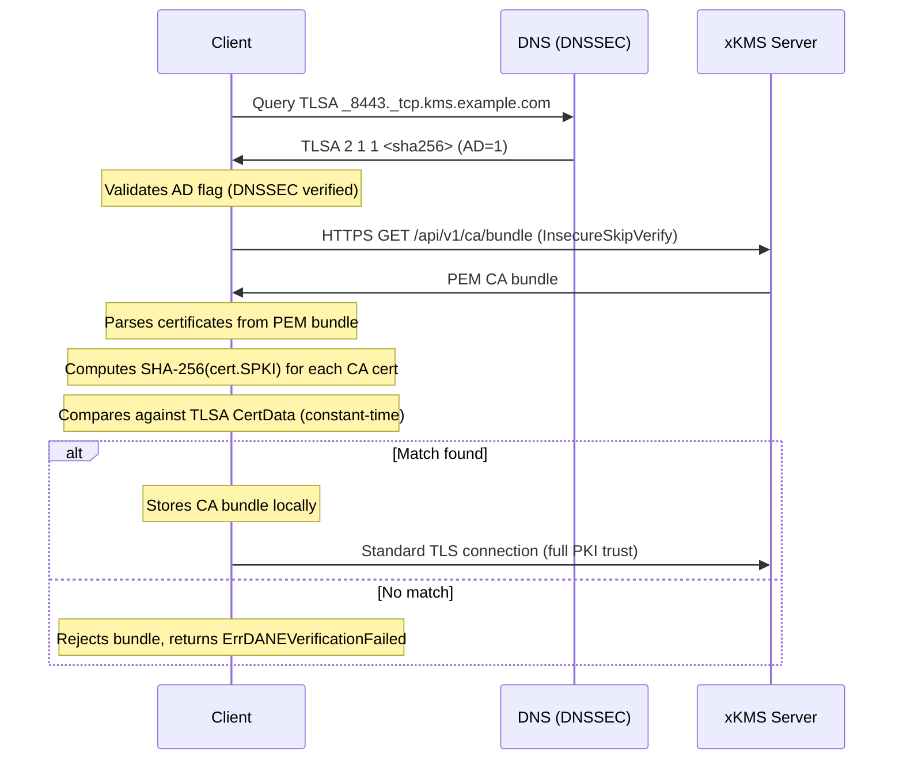

# DANE/TLSA Bootstrap

## Overview

DNS-Based Authentication of Named Entities (DANE) uses TLSA DNS records to associate X.509 certificates with domain names, as defined in [RFC 6698](https://datatracker.ietf.org/doc/html/rfc6698). go-xkms uses DANE as its highest-priority bootstrap mechanism because it requires zero pre-shared secrets -- the trust anchor is published in DNS and secured by DNSSEC.

## Why DANE for Bootstrap

The bootstrap problem requires a new node to obtain CA certificates from a server it cannot yet verify. Traditional approaches require distributing a trust anchor (a public key or pin) out-of-band before the first connection. DANE eliminates this requirement by leveraging the existing DNS infrastructure:

1. The CA certificate hash is published as a TLSA record in DNS.
2. DNSSEC provides a chain of trust from the IANA Root KSK down to the TLSA record.
3. The client resolves the TLSA record, fetches the CA bundle over HTTPS, and verifies the bundle against the TLSA data.

No pre-shared keys, no out-of-band distribution, no manual provisioning per node.

## DNSSEC Trust Chain

DANE security depends entirely on DNSSEC. The trust chain is:

```
IANA Root KSK (built into resolvers)
  -> Root Zone DNSKEY
    -> TLD DS record (e.g., .com)
      -> TLD DNSKEY
        -> Domain DS record (e.g., example.com)
          -> Domain DNSKEY
            -> TLSA RRSIG (signs the TLSA record)
              -> TLSA record (contains CA cert hash)
```

The resolver validates each link in the chain and sets the Authenticated Data (AD) flag in the DNS response when validation succeeds. go-xkms's DANE bootstrapper always requires the AD flag, rejecting responses from zones that are not DNSSEC-signed. DANE without DNSSEC provides no security guarantees.

## TLSA Record Format

A TLSA record has four fields:

```
_<port>._tcp.<hostname>.  IN  TLSA  <usage> <selector> <matching-type> <cert-data>
```

### Usage Field

| Value | Name | Description |
|-------|------|-------------|
| 0 | PKIX-TA | CA constraint; PKIX validation required |
| 1 | PKIX-EE | End-entity pin; PKIX validation required |
| **2** | **DANE-TA** | **Trust anchor; PKIX validation not required** |
| 3 | DANE-EE | End-entity pin; PKIX validation not required |

go-xkms uses **Usage 2 (DANE-TA)** as its primary use case. DANE-TA declares a trust anchor for the domain without requiring the client to have a pre-existing CA trust store -- which is exactly the bootstrap scenario.

### Selector Field

| Value | Name | Description |
|-------|------|-------------|
| 0 | Full certificate | Match against the full DER-encoded certificate |
| 1 | SPKI | Match against the DER-encoded SubjectPublicKeyInfo |

Selector 1 (SPKI) is recommended because the TLSA record remains valid when a certificate is reissued with the same key pair.

### Matching Type Field

| Value | Name | Description |
|-------|------|-------------|
| 0 | Exact | Full binary match of selected data |
| 1 | SHA-256 | SHA-256 hash of selected data |
| 2 | SHA-512 | SHA-512 hash of selected data |

SHA-256 (Matching Type 1) is the recommended default. It produces a compact 32-byte record while providing strong collision resistance.

## Recommended Configuration: 2 1 1

The default TLSA record generated by go-xkms uses:

- **Usage 2** (DANE-TA): Trust anchor, no PKIX required
- **Selector 1** (SPKI): Survives certificate reissuance with same key
- **Matching Type 1** (SHA-256): Compact, strong

This produces a TLSA record like:

```
_8443._tcp.kms.example.com. IN TLSA 2 1 1 a1b2c3d4e5f6...
```

## Verification Flow



The client uses `InsecureSkipVerify` during the HTTPS fetch because the CA certificate is not yet trusted -- DANE/TLSA verification replaces CA-based trust for this one-time bootstrap operation.

## Security Properties

- **No pre-shared secrets:** The trust anchor is published in DNS, eliminating out-of-band key distribution.
- **DNSSEC integrity:** The TLSA record is signed by the domain's DNSSEC keys, which chain up to the IANA Root KSK. Tampering is detected.
- **Constant-time comparison:** TLSA verification uses `crypto/subtle.ConstantTimeCompare` to prevent timing attacks.
- **One-shot usage:** After the CA bundle is stored locally, the node switches to standard TLS. The DANE bootstrap path is never used again.

## Bootstrap Method Comparison

| Property | DANE/TLSA | Noise_NK | SPKI Pin | Direct HTTPS |
|----------|-----------|----------|----------|--------------|
| Pre-shared secret | None | 32-byte public key | 32-byte SHA-256 pin | None |
| Trust anchor source | DNSSEC | Out-of-band | Out-of-band | System trust store |
| DNSSEC required | Yes | No | No | No |
| Forward secrecy | Depends on TLS suite | Yes (ephemeral DH) | Depends on TLS suite | Depends on TLS suite |
| Proxy-compatible | Yes (HTTPS) | No (raw TCP) | Yes (HTTPS) | Yes (HTTPS) |
| Server authentication | TLSA record verification | Structural (DH with known key) | SPKI pin verification | CA-based (system store) |
| Zero-touch provisioning | Yes | No | No | Yes (but weaker) |

## TLSA Record Generation

### Using the CLI

Generate a TLSA record from a CA certificate:

```bash
# Default: Usage=2, Selector=1, MatchingType=1 (DANE-TA, SPKI, SHA-256)
xkmsctl bootstrap dane generate-tlsa \
  --cert-file /etc/xkms/ca.pem \
  --hostname kms.example.com \
  --port 8443
```

Generate all common DANE-TA variants:

```bash
xkmsctl bootstrap dane generate-tlsa \
  --cert-file /etc/xkms/ca.pem \
  --hostname kms.example.com \
  --port 8443 \
  --all
```

### Using the Go API

```go
import "github.com/jeremyhahn/go-xkms/pkg/ca/dane"

// Generate the recommended 2 1 1 record.
rec, err := dane.GenerateTLSARecord(cert, "kms.example.com", 8443)
// rec.ZoneLine: "_8443._tcp.kms.example.com. IN TLSA 2 1 1 a1b2c3d4..."

// Generate all four common DANE-TA variants.
recs, err := dane.GenerateCommonTLSARecords(cert, "kms.example.com", 8443)
```

## DNS Zone File Examples

### Single TLSA Record (Recommended)

```dns
; DANE-TA, SPKI, SHA-256
_8443._tcp.kms.example.com. IN TLSA 2 1 1 (
    a1b2c3d4e5f6a7b8c9d0e1f2a3b4c5d6
    e7f8a9b0c1d2e3f4a5b6c7d8e9f0a1b2 )
```

### Multiple Records (Redundancy)

```dns
; Primary: SPKI + SHA-256
_8443._tcp.kms.example.com. IN TLSA 2 1 1 (
    a1b2c3d4e5f6a7b8c9d0e1f2a3b4c5d6
    e7f8a9b0c1d2e3f4a5b6c7d8e9f0a1b2 )

; Backup: Full cert + SHA-256
_8443._tcp.kms.example.com. IN TLSA 2 0 1 (
    f0e1d2c3b4a5f6e7d8c9b0a1f2e3d4c5
    a6b7c8d9e0f1a2b3c4d5e6f7a8b9c0d1 )
```

### Key Rollover

During certificate rotation, publish TLSA records for both the old and new certificates:

```dns
; Current certificate
_8443._tcp.kms.example.com. IN TLSA 2 1 1 <current-hash>

; Next certificate (pre-published before rotation)
_8443._tcp.kms.example.com. IN TLSA 2 1 1 <next-hash>
```

Remove the old record after TTL expiry plus a safety margin.

## DNSSEC Signing Requirements

For production deployments, the DNS zone must be DNSSEC-signed:

1. **Generate zone signing keys:** Create a Zone Signing Key (ZSK) and Key Signing Key (KSK) for the domain.
2. **Sign the zone:** Sign all records (including TLSA) with the ZSK.
3. **Publish DS records:** Submit DS records to the parent zone (your registrar).
4. **Verify the chain:** Use `dig +dnssec` or `delv` to confirm the full DNSSEC chain validates.

```bash
# Verify DNSSEC chain for a TLSA record
dig +dnssec TLSA _8443._tcp.kms.example.com

# Check the AD flag is set
dig +adflag TLSA _8443._tcp.kms.example.com
```

For development and testing, the low-level resolver (`pkg/ca/dane`) supports `RequireAD: false` in `ResolverConfig` to skip AD flag validation. The DANE bootstrapper in the SDK always enforces DNSSEC; this resolver-level option is only available when using the resolver directly.

## Error Handling

The DANE package uses typed errors:

```go
import "errors"

if errors.Is(err, dane.ErrNoTLSARecords) {
    // No TLSA records found for the queried name
}

if errors.Is(err, dane.ErrDNSSECRequired) {
    // DNSSEC AD flag not set; zone may not be signed
}

if errors.Is(err, dane.ErrTLSAVerificationFailed) {
    // No certificate matched any TLSA record
}

if errors.Is(err, dane.ErrDNSLookupFailed) {
    // DNS query failed (network, timeout, NXDOMAIN)
}
```

## Related Documentation

- [CA Bundle Bootstrap](./bootstrap.md) -- Bootstrap protocol overview and all methods
- [Integration Guide](./bootstrap-integration.md) -- Project-specific usage for go-xkms, xkey, go-trusted-ca, and go-trusted-platform
- [Bootstrap Configuration](../configuration/bootstrap.md) -- YAML configuration reference
- [Bootstrap CLI Commands](../usage/cli/bootstrap.md) -- CLI reference for DANE and other bootstrap commands
