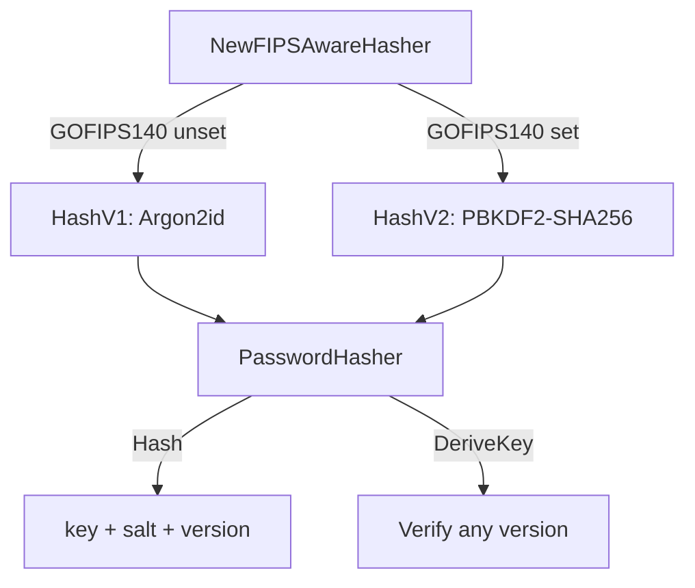

# FIPS 140 Strategy

## Overview

go-xkms provides transparent FIPS 140 mode detection and algorithm selection. When the `GOFIPS140` environment variable is set, cryptographic algorithm defaults automatically switch to FIPS-approved alternatives. No code changes are required.

**Packages**:
- `github.com/jeremyhahn/go-xkms/pkg/crypto/fips` -- mode detection and KDF selection
- `github.com/jeremyhahn/go-xkms/pkg/crypto/kdf` -- `PasswordHasher` with versioned algorithms

## FIPS Mode Detection

```go
import "github.com/jeremyhahn/go-xkms/pkg/crypto/fips"

if fips.Enabled() {
    // GOFIPS140 is set to a non-empty value
}
```

Detection checks `os.Getenv("GOFIPS140")`. Any non-empty value activates FIPS mode.

```bash
# Enable FIPS mode
export GOFIPS140=1

# Disable (default)
unset GOFIPS140
```

## KDF Selection

The `fips` package provides default KDF selectors that the rest of the system uses to pick algorithms:

```go
kdf := fips.DefaultKDF()      // "argon2id" or "pbkdf2"
luksKDF := fips.DefaultLUKSKDF() // "argon2id" or "pbkdf2"
```

| Mode | `DefaultKDF()` | `DefaultLUKSKDF()` |
|------|----------------|--------------------|
| Standard | `argon2id` | `argon2id` |
| FIPS | `pbkdf2` | `pbkdf2` |

Argon2id is the default because it provides superior resistance to GPU/ASIC attacks. PBKDF2 is selected in FIPS mode because it is the only password-based KDF approved under NIST SP 800-132.

## PasswordHasher

`PasswordHasher` in `pkg/crypto/kdf` provides FIPS-aware password hashing with versioned algorithms. Both adapters (Argon2id and PBKDF2) are always initialized, allowing verification of hashes produced by any version regardless of the current mode.



### Versions

| Version | Algorithm | Parameters |
|---------|-----------|------------|
| `HashV1` | Argon2id | time=3, memory=64 MiB, threads=4, keyLen=32 |
| `HashV2` | PBKDF2-SHA256 | iterations=600,000, keyLen=32 |

Salt length is 32 bytes for both versions (minimum accepted: 16 bytes).

### Usage

```go
import "github.com/jeremyhahn/go-xkms/pkg/crypto/kdf"

// Auto-selects version based on FIPS mode.
hasher := kdf.NewFIPSAwareHasher()

// Hash a password (generates random salt).
key, salt, version, err := hasher.Hash([]byte("my-password"))

// Store key, salt, and version alongside the account record.

// Later: verify by re-deriving with the stored salt and version.
derived, err := hasher.DeriveKey([]byte("my-password"), salt, version)
// Compare derived == key using constant-time comparison.
```

### Explicit Version Selection

```go
// Force Argon2id regardless of FIPS mode.
hasher, err := kdf.NewPasswordHasher(kdf.HashV1)

// Force PBKDF2 regardless of FIPS mode.
hasher, err := kdf.NewPasswordHasher(kdf.HashV2)

// Check current mode.
if hasher.IsFIPS() {
    // Using PBKDF2
}
```

### Cross-Version Verification

A hasher created with any version can verify hashes from any other version, because both Argon2id and PBKDF2 adapters are always initialized internally:

```go
// Hash was created in standard mode (V1/Argon2id).
key, salt, version, _ := standardHasher.Hash(password)

// System later switches to FIPS mode (V2/PBKDF2).
fipsHasher := kdf.NewFIPSAwareHasher()

// Verification still works -- DeriveKey dispatches on the stored version.
derived, err := fipsHasher.DeriveKey(password, salt, version)
```

## Integration Points

The FIPS strategy is consumed by several subsystems:

| Subsystem | Usage |
|-----------|-------|
| Barrier seal/unseal | KDF for deriving data encryption keys |
| PlatformStore | Password hashing for stored credentials |
| User management | Account password hashing |
| LUKS passphrase derivation | KDF for disk encryption keys |

## Error Handling

```go
var (
    ErrHasherInvalidVersion  // unsupported hash version
    ErrHasherInvalidPassword // empty password
    ErrHasherInvalidSalt     // salt is nil or shorter than 16 bytes
)
```

## See Also

- [Configuration: AEAD](../configuration/aead-auto-selection.md) -- authenticated encryption setup
- [Architecture: Symmetric Encryption](../architecture/symmetric-encryption.md) -- symmetric key architecture
