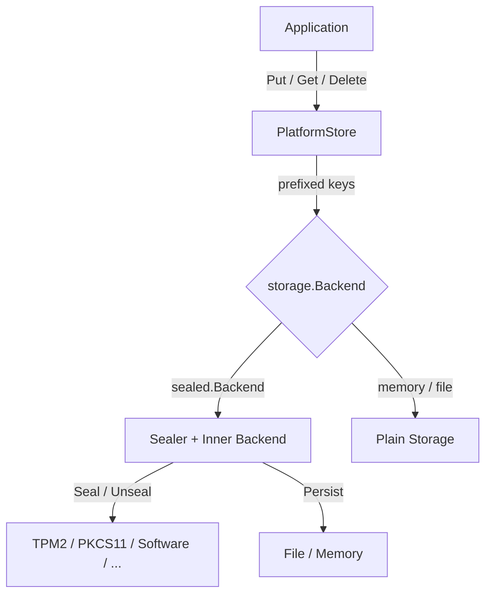

# PlatformStore

## Overview

PlatformStore is a named-secret credential store for the local machine, analogous to macOS Keychain or GNOME Keyring. It provides a simple Put/Get/Delete API for storing secrets that are transparently sealed and unsealed through the underlying storage backend.

**Package**: `github.com/jeremyhahn/go-xkms/pkg/seal`

## Architecture

PlatformStore wraps a `storage.Backend` and exposes a named-secret API. When the backend is a `sealed.Backend`, all values are transparently encrypted on write and decrypted on read. When backed by a plain memory or file backend, values pass through as-is (useful for testing).



All storage keys are prefixed with `platform-store/` to provide namespace isolation from other data in the same backend.

## Auto-Unseal Flow

When backed by a `sealed.Backend`, a `Get` call automatically unseals the secret if the sealer allows it. There is no explicit Unseal step -- the sealer's policy determines access:

1. **Put**: value is sealed and stored under `platform-store/<name>`
2. **Get**: sealed envelope is read from storage, passed to `Sealer.Unseal()`, and plaintext is returned
3. If the sealer's preconditions are met (e.g., TPM PCR state matches), the call succeeds transparently

This makes PlatformStore suitable for boot-time credential retrieval where TPM-sealed secrets become available once the system reaches the expected measured-boot state.

## Interface

```go
type PlatformStore interface {
    Put(ctx context.Context, name string, secret []byte) error
    Get(ctx context.Context, name string) ([]byte, error)
    Delete(ctx context.Context, name string) error
    Exists(ctx context.Context, name string) (bool, error)
    List(ctx context.Context) ([]string, error)
    Reseal(ctx context.Context, name string) error
}
```

### Reseal

`Reseal` reads the plaintext of a secret, deletes the old sealed copy, and writes it back so it is sealed with the current backend state. Use this after system state changes (e.g., kernel update altering TPM PCR values).

## Well-Known Secret Names

The package defines constants for common platform credentials:

| Constant | Key | Purpose |
|----------|-----|---------|
| `SecretUserPIN` | `platform/user-pin` | User PIN for the xkms barrier |
| `SecretLUKSPassphrase` | `platform/luks-passphrase` | LUKS disk encryption passphrase |
| `SecretPKCS11PIN` | `platform/pkcs11-pin` | PKCS#11 token PIN |
| `SecretTPM2Auth` | `platform/tpm2-auth` | TPM 2.0 authorization value |

Applications may store additional secrets under arbitrary names.

## Usage

```go
import (
    "context"

    "github.com/jeremyhahn/go-xkms/pkg/seal"
    "github.com/jeremyhahn/go-xkms/pkg/storage"
    sealedbackend "github.com/jeremyhahn/go-xkms/pkg/storage/sealed"
)

// Create a sealed storage backend (sealer comes from any of the 8 backends).
inner := storage.NewMemory()
backend, err := sealedbackend.New(inner, mySealer, nil)

// Create the platform store.
store, err := seal.NewPlatformStore(backend, nil)

ctx := context.Background()

// Store a secret.
err = store.Put(ctx, seal.SecretUserPIN, []byte("my-pin"))

// Retrieve it (auto-unseals through the sealer).
pin, err := store.Get(ctx, seal.SecretUserPIN)

// List all stored secret names.
names, err := store.List(ctx)

// Reseal after a system state change.
err = store.Reseal(ctx, seal.SecretUserPIN)
```

## PlatformStore vs PlatformSealer

| Aspect | PlatformSealer | PlatformStore |
|--------|---------------|---------------|
| Scope | Seal/unseal raw byte blobs | Persistent named-secret storage |
| API | `Seal(data) / Unseal(sealed)` | `Put(name, secret) / Get(name)` |
| Persistence | Caller manages storage | Built-in via `storage.Backend` |
| Use case | One-off seal operations | Long-lived credential vault |

PlatformSealer is the low-level primitive. PlatformStore builds on it (via `sealed.Backend`) to provide a complete credential management API.

## Error Handling

```go
var (
    ErrNilSealedBackend  // nil backend passed to NewPlatformStore
    ErrSecretNotFound    // named secret does not exist
    ErrInvalidSecretName // empty or whitespace-only name
    ErrResealFailed      // reseal operation failed (wraps cause)
)
```

## Thread Safety

`SealedPlatformStore` uses a `sync.RWMutex`. Reads (`Get`, `Exists`, `List`) acquire a read lock; writes (`Put`, `Delete`) acquire a write lock. `Reseal` performs a read-then-delete-then-write sequence using the public methods, each acquiring their own lock.

## See Also

- [Sealed Storage](../sealed-storage/README.md) -- the `sealed.Backend` decorator
- [Architecture: Storage](../architecture/storage.md) -- storage interface hierarchy
