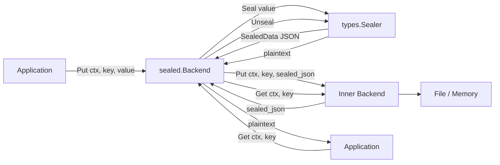

# Sealed Storage Backend

## Overview

The `sealed` package provides a storage backend decorator that transparently encrypts and decrypts values using a `types.Sealer`. It wraps any `storage.Backend` to create an encrypted-at-rest storage layer without changing the application's storage API.

**Package**: `github.com/jeremyhahn/go-xkms/pkg/storage/sealed`

This is a cross-platform alternative to full-disk encryption (e.g., LUKS). Rather than encrypting an entire partition, `sealed.Backend` encrypts individual values while keeping keys (paths) in the clear for listing and lookup.

## Architecture



### Data Flow

**Write path** (`Put`):
1. Plaintext value is sealed via `Sealer.Seal()`, producing a `types.SealedData` envelope
2. The envelope is JSON-marshaled
3. The JSON bytes are stored in the inner backend under the original key

**Read path** (`Get`):
1. JSON bytes are read from the inner backend
2. Deserialized into a `types.SealedData` envelope
3. Unsealed via `Sealer.Unseal()` to recover plaintext

**Passthrough operations** (`Delete`, `List`, `Scan`, `Exists`, `Close`):
Delegate directly to the inner backend without any encryption.

## Interface

`sealed.Backend` implements `storage.Backend`:

```go
type Backend struct { /* unexported */ }

func New(inner storage.Backend, sealer types.Sealer, sealOpts *types.SealOptions) (*Backend, error)

func (b *Backend) Get(ctx context.Context, key string) ([]byte, error)
func (b *Backend) Put(ctx context.Context, key string, value []byte) error
func (b *Backend) Delete(ctx context.Context, key string) error
func (b *Backend) List(ctx context.Context, prefix string) ([]string, error)
func (b *Backend) Scan(ctx context.Context, prefix string) (map[string][]byte, error)
func (b *Backend) Exists(ctx context.Context, key string) (bool, error)
func (b *Backend) Close() error
```

The constructor validates that both the inner backend and sealer are non-nil, and that `sealer.CanSeal()` returns true.

## Compatible Sealers

`sealed.Backend` works with all 8 backend sealers in go-xkms:

| Backend | Sealer Location | Seal Mechanism |
|---------|----------------|----------------|
| Software | `pkg/backend/software` | AES-GCM with derived key |
| PKCS#8 | `pkg/keyprovider/pkcs8` | File-based key wrapping |
| PKCS#11 | `pkg/backend/pkcs11` | HSM hardware encryption |
| TPM 2.0 | `pkg/tpm2` | TPM seal/unseal with PCR policy |
| AWS KMS | `pkg/backend/awskms` | AWS KMS Encrypt/Decrypt API |
| Azure Key Vault | `pkg/backend/azurekv` | Azure Key Vault wrap/unwrap |
| GCP KMS | `pkg/backend/gcpkms` | GCP KMS Encrypt/Decrypt API |
| HashiCorp Vault | `pkg/backend/vault` | Vault Transit engine |

## Usage

### Basic Setup

```go
import (
    "context"
    "github.com/jeremyhahn/go-xkms/pkg/storage/file"
    "github.com/jeremyhahn/go-xkms/pkg/storage/sealed"
)

ctx := context.Background()

// Inner backend for persistence.
inner, err := file.New("/var/lib/xkms/sealed-data")

// Create the sealed backend (sealer from any of the 8 backends).
backend, err := sealed.New(inner, mySealer, nil)

// Use the standard storage.Backend API -- encryption is transparent.
err = backend.Put(ctx, "credentials/db-password", []byte("s3cret"))

plaintext, err := backend.Get(ctx, "credentials/db-password")
// plaintext == []byte("s3cret")

keys, err := backend.List(ctx, "credentials/")
// keys == ["credentials/db-password"]
```

### With TPM 2.0 Sealer

```go
// TPM sealer binds data to platform PCR state.
tpmSealer := tpmBackend.Sealer()

backend, err := sealed.New(fileBackend, tpmSealer, &types.SealOptions{
    PCRSelection: []int{0, 1, 2, 3, 7},
})

// Data can only be unsealed when PCR values match.
err = backend.Put(ctx, "boot-secret", []byte("key-material"))
```

### With Cloud KMS Sealer

```go
// AWS KMS sealer uses envelope encryption.
awsSealer := awsBackend.Sealer()
backend, err := sealed.New(fileBackend, awsSealer, nil)
```

## Design Decisions

**Keys stored in the clear**: Storage keys (paths) are not encrypted. This allows `List` and `Exists` to work without decryption, and makes debugging and key management straightforward. Only values contain sensitive data.

**JSON envelope**: Sealed data is stored as a JSON-serialized `types.SealedData` struct. This preserves metadata (algorithm, nonce, etc.) needed for unsealing and allows the sealed backend to be storage-format agnostic.

**Sealer validation at construction**: `New` checks `CanSeal()` upfront so that a misconfigured sealer fails fast rather than silently storing unencrypted data.

## Error Handling

```go
var (
    ErrSealFailed        // seal operation failed
    ErrUnsealFailed      // unseal operation failed
    ErrSealerNotAvailable // sealer is nil or CanSeal() returned false
    ErrMarshalFailed     // JSON marshal of SealedData failed
    ErrUnmarshalFailed   // JSON unmarshal of SealedData failed
)
```

Errors from the inner backend (e.g., `storage.ErrNotFound`) propagate through unchanged.

## See Also

- [PlatformStore](../platform-store/README.md) -- named-secret API built on sealed.Backend
- [Architecture: Storage](../architecture/storage.md) -- storage interface hierarchy
- [Backends](../backends/) -- backend-specific sealer documentation
