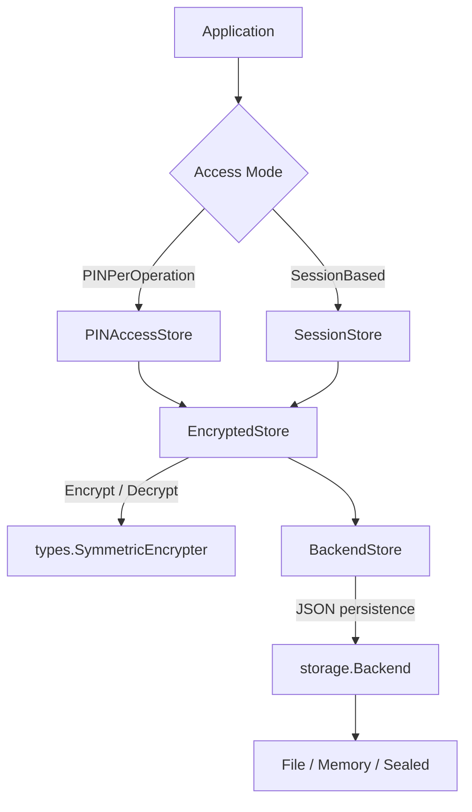
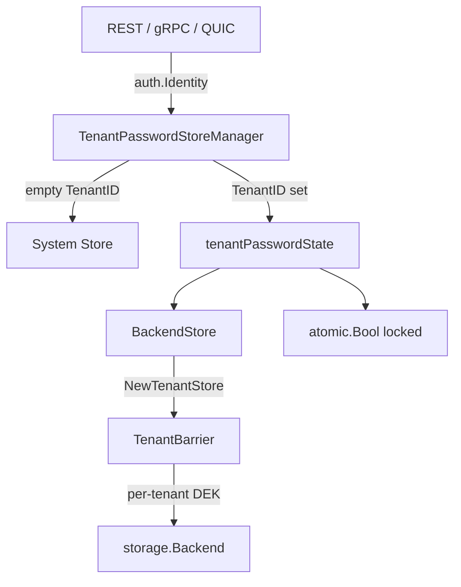

# Static Password Store

## Overview

The `staticpw` package provides a password manager for static credentials (login usernames, passwords, URLs, and notes). It supports multi-tenant isolation, hierarchical folder organization, case-insensitive name lookups, optional symmetric encryption, and two access control modes.

**Package**: `github.com/jeremyhahn/go-xkms/pkg/staticpw`

## Architecture



The store is composed as a layered decorator chain:

1. **BackendStore** -- core CRUD over `storage.Backend`, handles JSON serialization, folder operations, tenant prefixes
2. **EncryptedStore** -- wraps BackendStore, transparently encrypts the `Password` field on write via `types.SymmetricEncrypter`
3. **PINAccessStore** or **SessionStore** -- adds PIN-based access control on top of EncryptedStore

## Data Model

```go
type StaticPassword struct {
    ID         string    // deterministic, derived from Name + FolderPath
    Name       string    // human-readable label (required)
    Title      string    // optional display title, falls back to Name
    Username   string    // optional login username
    Password   string    // the stored password (required)
    URL        string    // optional service URL
    Notes      string    // optional user notes
    FolderPath string    // hierarchical folder (e.g. "Work/Email")
    BackendID  string    // which encryption backend encrypted this entry
    ExpiresAt  time.Time // optional expiration (zero = no expiry)
    CreatedAt  time.Time // creation timestamp
    UpdatedAt  time.Time // last modification timestamp
    ReadOnly   bool      // auto-generated entries that cannot be modified
}
```

IDs are deterministic: `strings.ToLower(folderPath + "/" + name)` (or just `strings.ToLower(name)` for root-level entries).

## Store Interface

```go
type Store interface {
    Add(pw *StaticPassword) error
    Get(idOrName string) (*StaticPassword, error)
    List() ([]*StaticPassword, error)
    Update(pw *StaticPassword) error
    Delete(idOrName string) error
    ListByFolder(folderPath string) ([]*StaticPassword, error)
    ListFolders() ([]string, error)
    MoveToFolder(idOrName string, folderPath string) error
    Close() error
}
```

`Get` and `Delete` accept either an ID or a name. An exact key lookup is attempted first; if that fails, a case-insensitive name scan is performed.

## Multi-Tenant Support

`BackendStore` supports tenant isolation through key prefixes:

```go
// Single-tenant (default prefix: "staticpw/")
store := staticpw.NewStore(backend)

// Multi-tenant (prefix: "<tenantID>/staticpw/")
store, err := staticpw.NewTenantStore(backend, "org-42")
```

Tenant IDs must be 1-64 characters, start with an alphanumeric character, and contain only alphanumeric characters, hyphens, and underscores. Each tenant's data is fully isolated by its key prefix.

## Encryption

`EncryptedStore` wraps any `Store` and encrypts the `Password` field using a `types.SymmetricEncrypter`:

```go
encStore, err := staticpw.NewEncryptedStore(backendStore, myAESEncrypter)

// Add -- password field is encrypted before storage
err = encStore.Add(&staticpw.StaticPassword{
    Name:     "GitHub",
    Password: "s3cret",
    URL:      "https://github.com",
})

// Get -- returns entry with password still encrypted
entry, err := encStore.Get("GitHub")

// GetDecrypted -- decrypts the password field on demand
entry, err := encStore.GetDecrypted("GitHub")
```

Encrypted passwords are stored as `ENC:<base64(json(EncryptedData))>`. Plaintext entries (pre-encryption migration) are returned as-is for backward compatibility.

### Migration

`MigrateToEncrypted` reads all existing plaintext entries and re-writes them with encrypted password fields, skipping already-encrypted entries:

```go
err := encStore.MigrateToEncrypted()
```

## Access Modes

### PINPerOperation

Requires a user PIN for every decryption. Non-decrypting operations (Add, List, etc.) proceed without PIN verification.

```go
pinStore, err := staticpw.NewPINAccessStore(encStore, pinManager)

// Listing works without PIN
entries, err := pinStore.List()

// Decryption requires PIN each time
entry, err := pinStore.GetDecrypted("GitHub", "1234")
```

### SessionBased

Requires a single `Unlock` call with a valid PIN. Once unlocked, all decryption operations succeed until `Lock` is called. Uses `atomic.Bool` for lock-free state checks.

```go
sessionStore, err := staticpw.NewSessionStore(encStore, pinManager)

// Unlock the session
err = sessionStore.Unlock("1234")

// Decryption works without re-entering PIN
entry, err := sessionStore.GetDecrypted("GitHub")

// Lock when done
err = sessionStore.Lock()
```

## Folder Organization

Entries are organized into a hierarchical folder structure. Nested folders are derived automatically:

```go
// Add entries in different folders
store.Add(&staticpw.StaticPassword{
    Name: "Gmail", Password: "...", FolderPath: "Work/Email",
})
store.Add(&staticpw.StaticPassword{
    Name: "AWS Console", Password: "...", FolderPath: "Work/Cloud",
})

// List all folders (includes parent paths)
folders, _ := store.ListFolders()
// ["Work", "Work/Cloud", "Work/Email"]

// List entries in a specific folder
entries, _ := store.ListByFolder("Work/Email")

// Move an entry to a different folder (regenerates ID)
err := store.MoveToFolder("Gmail", "Personal/Email")
```

## Password Generation

The package includes a cryptographically secure password generator using `crypto/rand`:

```go
// Default: 32 characters, all character sets
pw, err := staticpw.GeneratePassword(0, "")

// Custom: 16 characters, alphanumeric only
pw, err := staticpw.GeneratePassword(16, "alphanumeric")

// Length range: 8-128 characters
```

## Expiry Checking

`ExpiryChecker` runs a background goroutine that periodically scans for and deletes expired entries:

```go
checker := staticpw.NewExpiryChecker(store, 5*time.Minute, func(pw *staticpw.StaticPassword) {
    log.Printf("expired: %s", pw.Name)
})
checker.Start()
defer checker.Stop()
```

## Error Handling

All errors are declared as typed package-level variables:

| Error | Meaning |
|-------|---------|
| `ErrPasswordNotFound` | Entry not found by ID or name |
| `ErrPasswordExists` | Duplicate entry detected |
| `ErrPasswordReadOnly` | Cannot modify auto-generated entry |
| `ErrStoreClosed` | Store has been closed |
| `ErrStoreLocked` | Session store is locked |
| `ErrInvalidTenantID` | Invalid tenant identifier |
| `ErrEncryptFailed` | Password encryption failed |
| `ErrDecryptFailed` | Password decryption failed |
| `ErrStoreNotLocked` | Unlock called when already unlocked |
| `ErrStoreAlreadyLocked` | Lock called when already locked |
| `ErrNilBarrierRegistry` | Barrier registry is nil |
| `ErrNotConfigured` | Password store not configured |

## Personal and Shared Password Scoping

Within a tenant, passwords are separated into **personal** (per-user) and **shared** (tenant-wide) namespaces using key prefix isolation.

### Key Prefix Layout

```
# System (single-tenant, unchanged):
staticpw/{id}.json

# Tenant shared passwords:
{tenantID}/staticpw/shared/{id}.json

# Tenant personal passwords:
{tenantID}/staticpw/users/{userID}/{id}.json
```

### ScopedStore

`ScopedStore` is a composite `Store` that wraps a shared `BackendStore` and a personal `BackendStore`. It routes operations based on the password's `Shared` flag:

```go
// Create stores for a specific user within a tenant.
shared, _ := staticpw.NewSharedTenantStore(backend, "acme")
personal, _ := staticpw.NewPersonalTenantStore(backend, "acme", "alice@acme.com")
scoped, _ := staticpw.NewScopedStore(shared, personal, "alice@acme.com")

// Add a personal password (default).
scoped.Add(&staticpw.StaticPassword{Name: "My Gmail", Password: "..."})

// Add a shared password.
scoped.Add(&staticpw.StaticPassword{Name: "Team AWS", Password: "...", Shared: true})

// List all (personal + shared).
all, _ := scoped.List()

// List by scope.
personalOnly, _ := scoped.ListByScope(staticpw.ScopePersonal)
sharedOnly, _ := scoped.ListByScope(staticpw.ScopeShared)
```

### Routing Rules

| Operation | Shared=true | Shared=false (default) |
|-----------|-------------|------------------------|
| **Add** | → shared store | → personal store |
| **Get** | personal first, fallback shared | personal first, fallback shared |
| **Delete** | personal first, fallback shared | personal first, fallback shared |
| **Update** | → shared store | personal first, fallback shared |
| **List** | merged from both | merged from both |
| **ListByScope** | filter by scope | filter by scope |

### PasswordScope

```go
type PasswordScope string

const (
    ScopePersonal PasswordScope = "personal"
    ScopeShared   PasswordScope = "shared"
    ScopeAll      PasswordScope = "all"
)
```

### REST API

List with scope filter: `GET /api/v1/passwords?scope=personal`

Add a shared password:

```json
POST /api/v1/passwords
{
    "name": "Team AWS",
    "password": "s3cret",
    "shared": true
}
```

Response fields include `owner_id` and `shared` for each entry.

### Cross-User Isolation

Personal password isolation is enforced by key prefix separation at the storage layer. A user's `ScopedStore.personal` store is keyed to their userID — no cross-user access is possible without constructing a store with a different userID.

### Shared Password Ownership

Shared passwords track their creator via the `OwnerID` field, which is stamped automatically on `Add`. Modification (update/delete) of shared passwords is restricted:

| Caller | Allowed |
|--------|---------|
| Owner (`identity.Subject == pw.OwnerID`) | Yes |
| `admin` role | Yes |
| `so` role | Yes |
| Any other user | No — returns `ErrNotOwner` |

Personal passwords (`Shared=false`) skip ownership checks entirely — they are inherently scoped to the owner by key prefix isolation. Ownership enforcement is applied at the servicer layer, not the store layer.

### Migration

To migrate legacy tenant entries (from `{tenantID}/staticpw/` to `{tenantID}/staticpw/shared/`):

```go
count, err := staticpw.MigrateToScopedLayout(backend, "acme")
```

This moves existing entries to the shared prefix and marks them with `Shared: true`. Already-migrated entries (under `shared/` or `users/`) are skipped. The migration is idempotent.

### New Errors

| Error | Meaning |
|-------|---------|
| `ErrInvalidUserID` | User ID is empty, too long, or has invalid characters |
| `ErrNotOwner` | Non-owner tried to modify a shared password |
| `ErrInvalidScope` | Unrecognized scope value |

## Per-Tenant Password Store Manager

`TenantPasswordStoreManager` manages per-tenant password stores backed by `TenantBarrier` encryption. Each tenant gets an independent encrypted store with session-level lock state.

### Architecture



### Usage

```go
// Create manager with barrier registry and system fallback store
manager, err := staticpw.NewTenantPasswordStoreManager(barrierRegistry, systemStore)

// Resolve store based on tenant identity
store, err := manager.ResolveStore("org-42")  // tenant store
store, err := manager.ResolveStore("")         // system store

// Session lock lifecycle
err = manager.UnlockTenant("org-42")   // requires unsealed barrier
err = manager.LockTenant("org-42")

// Query status
status, err := manager.TenantStoreStatus("org-42")
// status.IsLocked, status.BarrierSealed, status.PasswordCount

// Cleanup
err = manager.Close()
```

### Session Lock vs Barrier Seal

Two independent protection layers:

| Layer | Scope | Controls | Reset |
|-------|-------|----------|-------|
| **Barrier seal** | Per-tenant DEK | Encryption/decryption of stored data | `UnsealTenant` on `BarrierRegistry` |
| **Session lock** | Per-tenant session | API-level access gating | `UnlockTenant` / `LockTenant` |

- Tenant stores start **locked** (session lock is true by default)
- `UnlockTenant` requires the barrier to be **unsealed** first
- When the barrier is sealed, all store operations fail regardless of session lock state
- `LockTenant` is always permitted (lightweight API gate)

### REST API Endpoints

| Endpoint | Method | Description |
|----------|--------|-------------|
| `/passwords/unlock` | POST | Unlock tenant session (requires unsealed barrier) |
| `/passwords/lock` | POST | Lock tenant session |
| `/passwords/status` | GET | Returns lock state, barrier seal state, password count |

### Error Mapping

| Error | HTTP Status | Meaning |
|-------|-------------|---------|
| `ErrStoreLocked` | 423 Locked | Session is locked, unlock first |
| `ErrStoreNotLocked` | 409 Conflict | Already unlocked |
| `ErrStoreAlreadyLocked` | 409 Conflict | Already locked |
| `seal.ErrTenantSealed` | 503 Service Unavailable | Barrier not unsealed |
| `seal.ErrTenantNotFound` | 404 Not Found | Unknown tenant |

### Concurrency

`TenantPasswordStoreManager` uses `sync.Map` for lock-free tenant state caching and `atomic.Bool` for session lock transitions. No mutexes are held during normal operations.

## Thread Safety

`BackendStore` uses a `sync.RWMutex` for all operations. `SessionStore` uses `atomic.Bool` for lock-free session state transitions. `TenantPasswordStoreManager` uses `sync.Map` and `atomic.Bool` for lock-free concurrent access across tenants.

## See Also

- [Architecture: Storage](../architecture/storage.md) -- storage interface hierarchy
- [Sealed Storage](../sealed-storage/README.md) -- encrypted backend for underlying storage
- [PlatformStore](../platform-store/README.md) -- platform credential store
