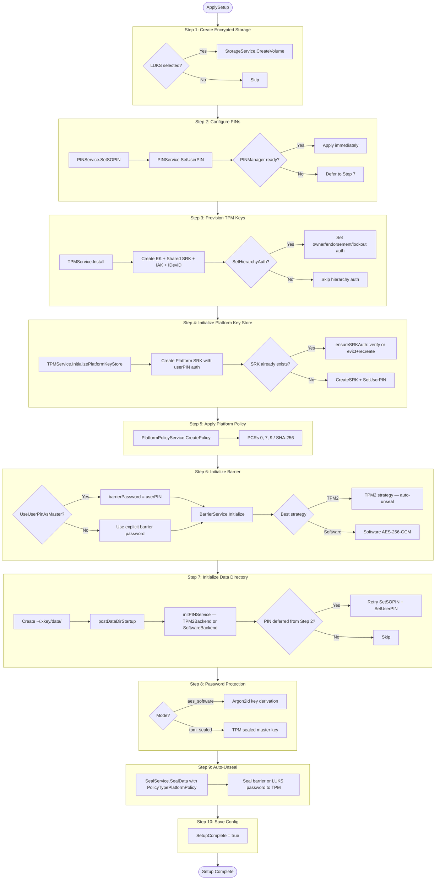
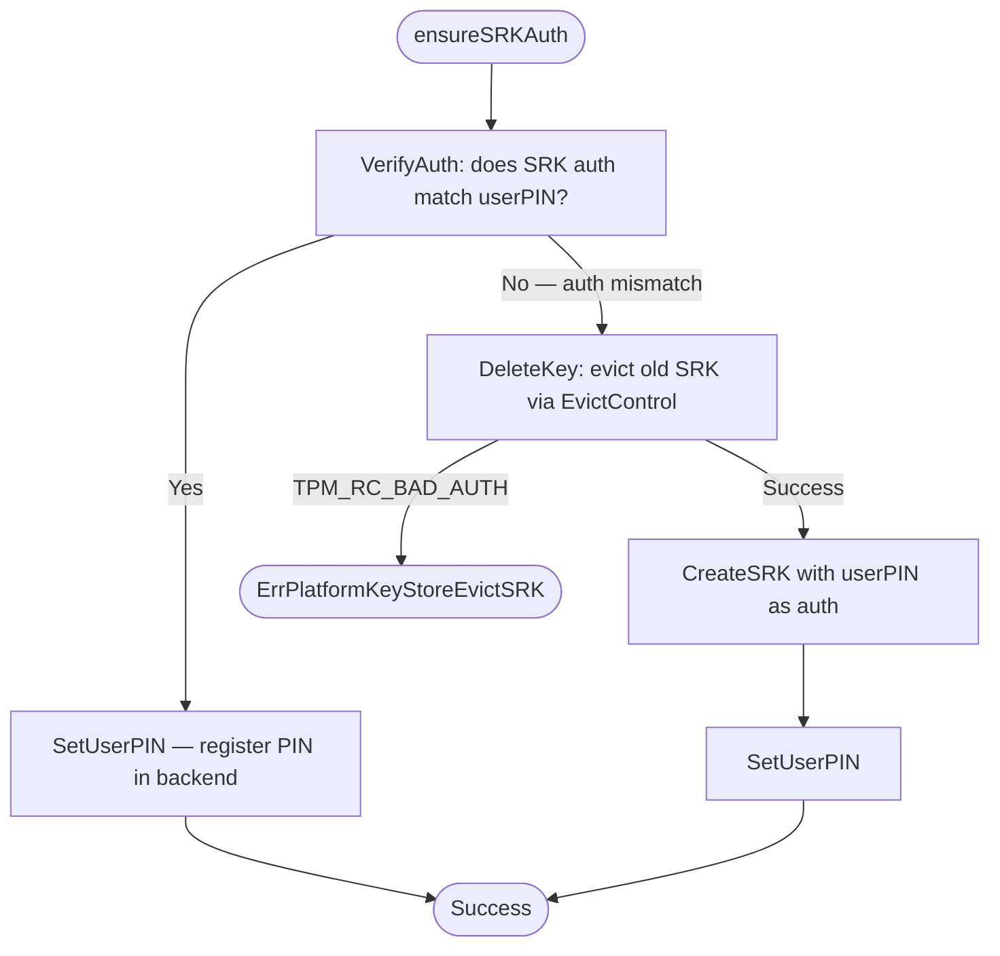
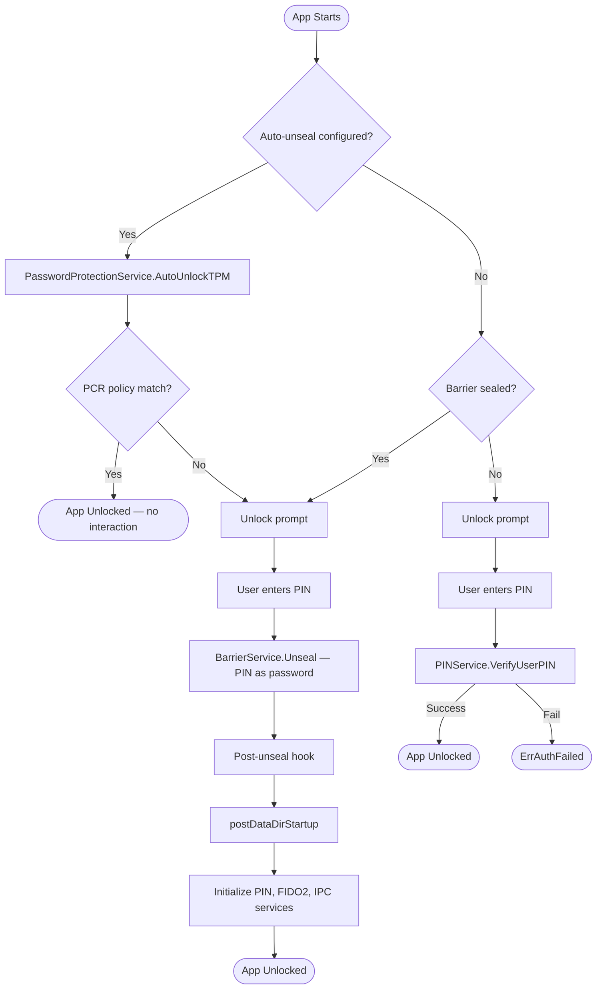
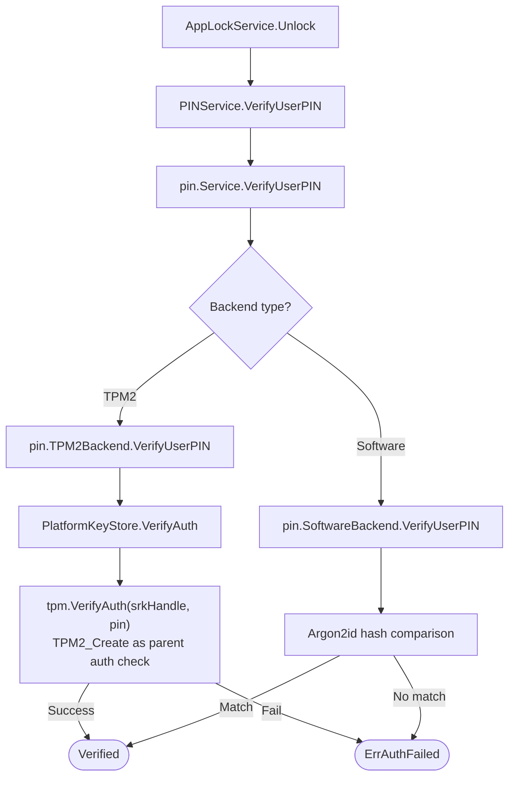
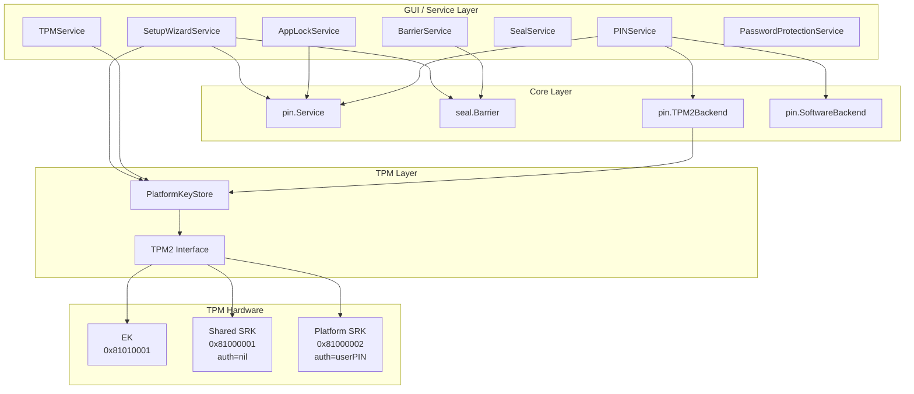

<!-- Copyright (c) 2025 Jeremy Hahn -->
<!-- Copyright (c) 2025 Automate The Things, LLC -->

# Setup Wizard and Unlock Flow

This document describes the backend execution flow of the setup wizard, the returning user startup/unlock process, and the component architecture that ties them together.

## Setup Wizard Backend Execution (ApplySetup)

The `SetupWizardService.ApplySetup()` method executes 10 sequential steps. Each step delegates to a dedicated service. Failures in non-critical steps are recorded as warnings; critical failures abort the wizard.

### Step 4 Detail: Platform SRK Provisioning

The Platform SRK (at handle `0x81000002`) is the sole key used for PIN verification. The `ensureSRKAuth` method handles the case where the SRK already exists from a prior installation:

If eviction fails because the TPM owner hierarchy has auth from a prior installation, `Initialize` returns `ErrPlatformKeyStoreEvictSRK` with a message directing the user to clear the TPM or provide the correct SO PIN. There is no fallback to the Shared SRK — the Platform SRK is the only key used for PIN management.

## Returning User Startup Flow

### PIN Verification Chain

## Component Architecture

### TPM Handle Assignments

| Handle | Name | Auth | Purpose |
|--------|------|------|---------|
| `0x81010001` | Endorsement Key (EK) | Hierarchy-controlled | Platform identity, credential activation |
| `0x81000001` | Shared SRK (SSRK) | nil (empty) | TCG-standard parent for sealed objects (barrier, seal service) |
| `0x81000002` | Platform SRK | userPIN | PIN verification via password auth |

The Shared SRK is provisioned during `TPMService.Install()` and is used **only** as a parent key for sealed objects created by the barrier and seal services. The Platform SRK is provisioned during `TPMService.InitializePlatformKeyStore()` and is the sole key used for PIN verification. These two keys serve distinct purposes and must not be conflated.
